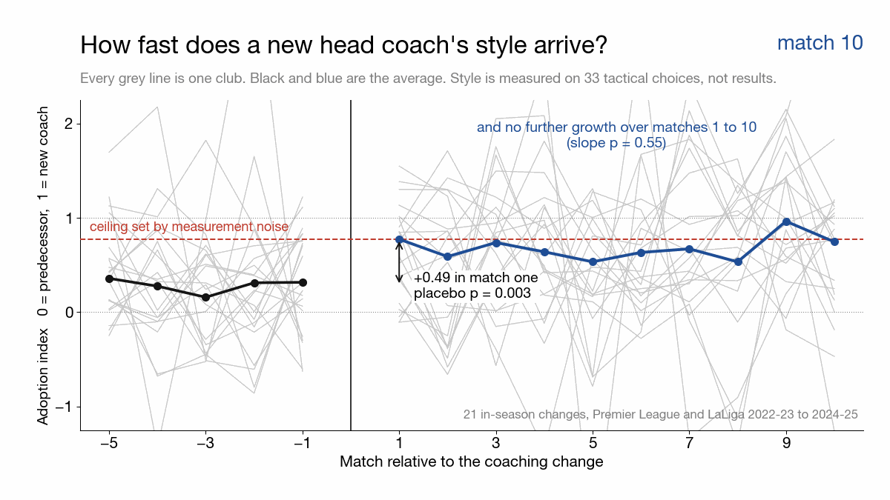
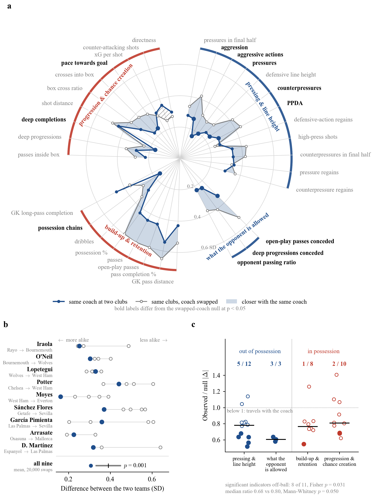
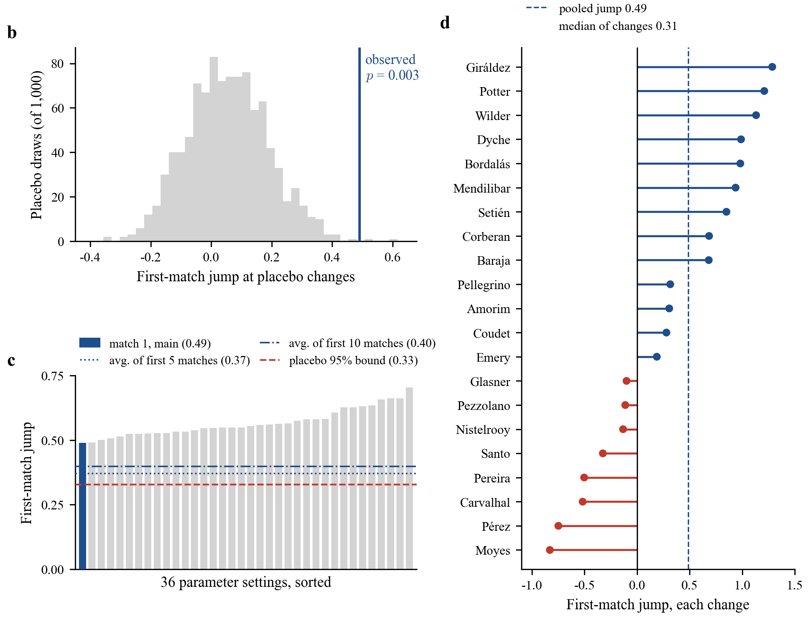
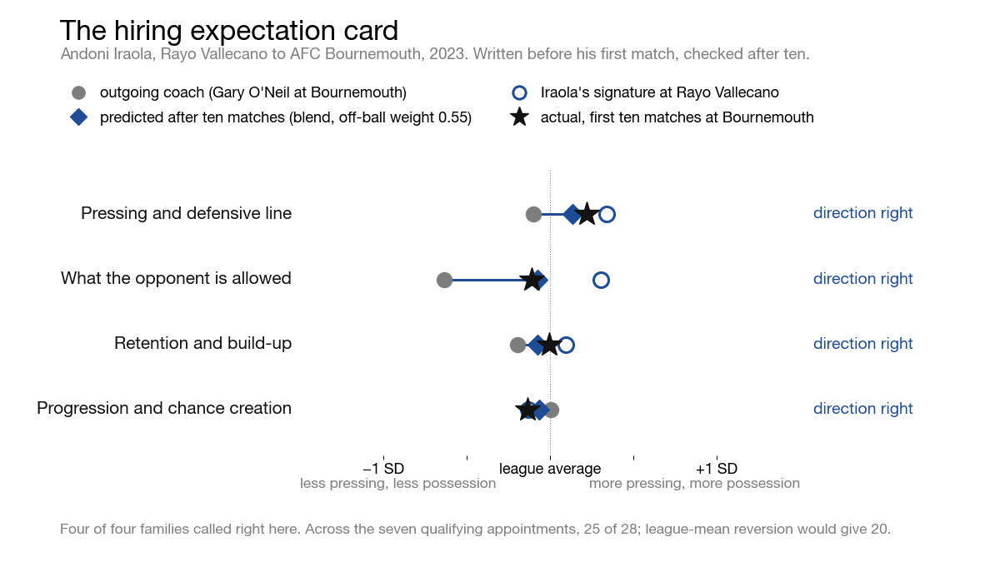
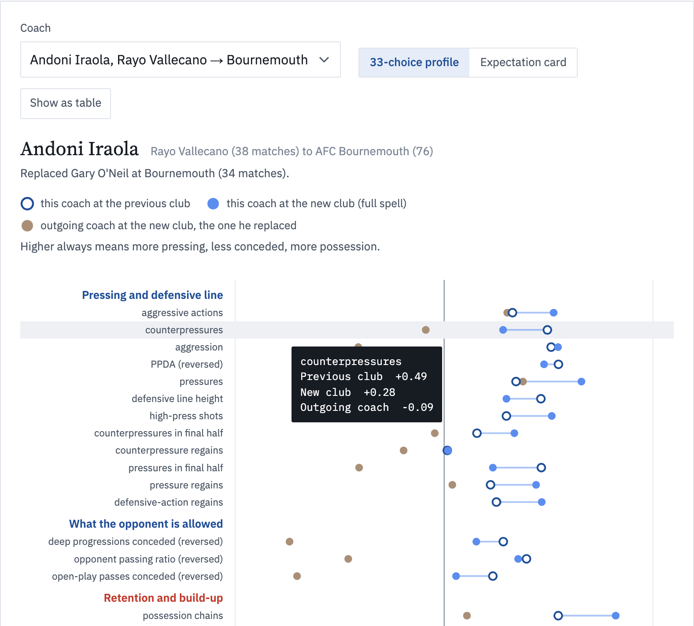

<h1 align="center">Coach-Specific Capital</h1>

<p align="center"><b>What a head coach takes to the next club, and how fast it arrives</b></p>

<p align="center"></p>
<p align="center"><sub>Each grey line is one of 21 in-season coaching changes; 0 is the outgoing coach's style and 1 the new coach's. The new style arrives in the first match and does not grow afterwards.</sub></p>

<p align="center">
<a href="https://coach-capital.pages.dev"></a>
</p>

<p align="center">


<a href="LICENSE"></a>
</p>

<p align="center">
<a href="#at-a-glance">At a glance</a> &nbsp;·&nbsp;
<a href="#three-findings">Findings</a> &nbsp;·&nbsp;
<a href="#interactive-explorer">Explorer</a> &nbsp;·&nbsp;
<a href="#how-the-study-works">Method</a> &nbsp;·&nbsp;
<a href="#what-is-in-this-repository">Repository</a> &nbsp;·&nbsp;
<a href="#data-availability">Data</a>
</p>

<br>

<h3 align="center">Clubs hire a head coach for a playing identity.<br>We measured which half of it travels with the person, and how fast it arrives.</h3>

<br>

## At a glance

<table>
<tr>
<td align="center" valign="top" width="50%">
<h2>0.31 <sub>vs</sub> 0.39</h2>
standard deviations between one coach's two teams, against the same two clubs under a swapped coach<br><br>
<sub>9&nbsp;coaches · 20,000&nbsp;permutations · p&nbsp;=&nbsp;0.001</sub>
</td>
<td align="center" valign="top" width="50%">
<h2>8 of 11</h2>
tactical choices that follow the coach are played without the ball<br><br>
<sub>11&nbsp;of&nbsp;33 significant · Fisher&nbsp;p&nbsp;=&nbsp;0.03</sub>
</td>
</tr>
<tr>
<td align="center" valign="top" width="50%">
<h2>+0.49</h2>
shift towards the new coach's style in the first match, and no further growth over the next ten<br><br>
<sub>21&nbsp;in-season changes · placebo&nbsp;p&nbsp;=&nbsp;0.003</sub>
</td>
<td align="center" valign="top" width="50%">
<h2>25 of 28</h2>
directions of change called right by the hiring expectation card<br><br>
<sub>7&nbsp;appointments · league-mean reversion gets&nbsp;20</sub>
</td>
</tr>
</table>

## Three findings

### 1. The out-of-possession half of a playing identity travels with the coach

<p align="center"></p>

Nine coaches managed two different clubs for at least 15 matches each. Across 33 tactical choices, the
same coach's two teams sit 0.31 standard deviations apart. Keep the two clubs, swap in another coach of
those clubs, and the distance grows to 0.39 (p = 0.001 against 20,000 permutations, robust to dropping any
one coach). Eleven choices follow the coach significantly, and eight of them are played off the ball
(pressing, counterpressing, what the opponent is allowed). Possession and build-up point the same way
without reaching significance. It is a tendency, not a dichotomy, and it weakens when the spell threshold is
relaxed.

<details>
<summary>Figure notes</summary>
<br>

**(a)** The 33 choices arranged in four families that were fixed before any result was seen (blue arcs out
of possession, red arcs in possession). The radius is the mean absolute difference between two spells in
league-season standard deviations, blue for the same coach at two clubs and grey for the same two clubs
with the coach swapped (mean of 20,000 permutations). Blue shading marks where the coach's two teams are
closer than the null, hatching where they are further apart, and bold labels are significant at p < 0.05.
**(b)** The nine movers, one row each. The blue dot is the distance between the coach's two teams, the open
circles the distance after swapping in each other coach of those clubs; the bottom row is the mean of all
nine against the 95% range of the swaps. **(c)** Observed over null distance for every choice, by family.
Filled points are significant, the bar is the family median, and the fraction on top counts significant
choices.
</details>

### 2. The new style arrives in the first match, not over a season

<p align="center"></p>

The adoption index places every match on a line from the outgoing coach's style (0) to the new coach's
eventual style (1). Across 21 in-season coaching changes it sits near the old style before the change,
jumps by 0.49 in the new coach's first match, and does not move over the next ten matches, as the animation at
the top of this page shows. Single-match noise caps how high the index can be measured to rise, and the
first match already reaches that cap. A placebo of pseudo-changes placed inside 63 uninterrupted spells
rarely produces a jump that large (p = 0.003), and the jump holds across 36 parameter settings. For a club
that changes coach mid-season, the new style is there from the first match.

<details>
<summary>Figure notes</summary>
<br>

**(b)** The first-match jump against 1,000 placebo changes. **(c)** The jump under 36 parameter settings
(main setting in blue), with the placebo 95% bound and the jump computed from the average of the first 5 or
first 10 matches instead of match 1 alone. **(d)** The first-match jump change by change; the dashed line is
the pooled jump of 0.49, and the median of the individual jumps is 0.31.
</details>

### 3. A hiring expectation card turns this into something a club can write down

<p align="center"></p>

Before an appointment, blend the coach's signature at the previous club with the outgoing coach's signature
at the new club, family by family, and write down what the team should look like after ten matches. For
the seven appointments whose predecessor managed at least ten matches, the blend has the lowest error of the
three options (keep the predecessor, import the coach, blend) in every family, and calls the direction of
change in 25 of 28 cases, against 20 for league-mean reversion. The blend weights are estimated on the same
small sample; refitted with each appointment left out, the blend still has the lowest error in every family.
Seven appointments is a small number. The card is a reference to check a new coach against, separately
from results, not a rule for deciding whom to hire.

## Interactive explorer

<p align="center"><a href="https://coach-capital.pages.dev"><b>coach-capital.pages.dev</b></a> &nbsp;·&nbsp; English · Español · 中文</p>

<p align="center"><a href="https://coach-capital.pages.dev"></a></p>
<p align="center"><sub>Pick a coach and see all 33 choices at both clubs, next to the coach he replaced</sub></p>

One static page with two views. The explainer walks through the evidence in plain language. The explorer
lets you pick any of the nine coaches who moved clubs, or any of the 21 in-season changes match by match.
Everything the page shows is either a result already in `results/` or a spell-level average over at least 15
matches; it carries no StatsBomb statistics at match level. The page is hosted at coach-capital.pages.dev and is not part of this repository.

## How the study works

StatsBomb team statistics for the Premier League and LaLiga, 2022-23 to 2024-25 (2,280 matches, 144 coaching
spells). Each team-match becomes a vector of 33 tactical choices, covering pressing, counterpressing, the
defensive line, possession, build-up and progression. Outcome measures such as goals are left out, because
the question is how a team plays rather than how well. Every choice is standardised within league and season
and passes a split-half reliability screen. The four families (two out of possession, two in possession) were
fixed before any result was seen.

| | Question | Design | Sample |
|---|---|---|---|
| **Portability** | What travels with the coach? | The same coach's two spells against a permutation null that keeps the club pair and swaps in another coach of those clubs | 9 coaches, at least 15 matches at each club |
| **Installation** | How fast does the new style arrive? | An adoption index from the predecessor's baseline (0) to the new coach's eventual signature (1), against pseudo-changes inside uninterrupted spells | 21 in-season changes, 63 placebo spells |
| **Forecast** | Can a club write it down in advance? | A blend of the coach's prior signature and the outgoing coach's, family by family, checked on the first ten matches | 7 appointments |

A fourth analysis (who loses playing time after a change) is a clean null result under a
difference-in-differences design. It is not part of the abstract, and its results will be released with the full paper.

## What is in this repository

This repository holds the two figures of the submitted abstract, the aggregate results behind every number in
the abstract, and the scripts that draw abstract Figure 2 and the README images from those results. The interactive explorer is hosted separately at
[coach-capital.pages.dev](https://coach-capital.pages.dev). The analysis code
(building the team-match panel from the licensed data, the permutation tests, the adoption index and its
placebo, the forecast and hiring cards), the manuscript figures and the remaining results will be released with
the full paper.

Everything below runs from `results/` alone, with no licensed data.

```bash
python -m venv .venv && source .venv/bin/activate
pip install -r requirements.txt

python code/abstract_fig2_fullpage.py     # Figure 2 of the abstract
python code/readme_assets.py              # the two README animations and the Finding 2 image
```

Scripts resolve the repository root from their own location, so the working directory does not matter. Both
scripts were rerun from a clean copy of this repository.

<details>
<summary><b>Where each number in the abstract comes from</b></summary>
<br>

| Statement in the abstract | File | Field |
|---|---|---|
| Same coach across two clubs differs by 0.31 SD, against 0.39 when the coach is swapped, p = 0.001 | `results/portability_rewire_v2_vector.json` | `variants.main_z33_ge15.obs_l1`, `null_l1`, `p_l1` |
| Robust to dropping any one coach | `results/portability_loo.json` | `leave_one_out.<coach>.p_l1` (largest 0.0102) |
| 11 of 33 dimensions follow the coach; 8 off-ball; Fisher p = 0.03 | `results/offball_enrichment.json` | `n_sig`, `n_sig_offball`, `fisher_p_onesided` |
| The off-ball tendency weakens when the spell threshold is relaxed | `results/offball_enrichment_variants.json` | variant `ge5_all18` |
| Adoption index jumps 0.49 in the first match; placebo p = 0.003; 63 uninterrupted spells | `results/install_jump_placebo.json` | `observed_jump`, `p_greater`, `pool_spells` |
| The jump is the full measurable shift given finite-sample noise | `results/install_curve_diagnostics.json` | `ceiling.ceiling_jump`, `ceiling.observed_over_ceiling` |
| No growth over the next ten matches | `results/install_curve_diagnostics.json` | `curve.slope_k1_10`, `curve.p_k1_10` |
| Seven appointments; blend beats both single sources in every family; direction right in 25 of 28 against 20 for league-mean reversion | `results/hiring_cards.json` | `summary`, `robustness` |
| 2,280 matches (4,560 team-matches), 144 coaching spells, 33 dimensions | `results/methods_support_stats.json`, `results/portability_rewire_v2_vector.json` | `sample_flow.team_matches`, `sample_flow.spells`, `variants.main_z33_ge15.n_dims` |
</details>

<details>
<summary><b>Script index</b></summary>
<br>

| Script | What it does |
|---|---|
| `abstract_fig2_fullpage.py` | Figure 2 of the submitted abstract, full page (installation) |
| `readme_assets.py` | The two README animations (installation, hiring card) and the Finding 2 image cropped from abstract Figure 2 |

Abstract Figure 1 is built from the licensed-data panel; its script follows with the full paper.
</details>

<details>
<summary><b>Repository map</b></summary>
<br>

```
code/              the scripts for abstract Figure 2 and the README images
results/           the 14 aggregate tables behind the abstract and the figures here (JSON, CSV, NPZ null distribution)
figures/           the two full-page figures of the submitted abstract
assets/            the two README animations, the Finding 2 image and an explorer screenshot
data/              derived tables (not shipped; schema in data/README.md)
```
</details>

## Data availability

The event and team-statistics data (StatsBomb, Premier League and LaLiga, 2022-23 to 2024-25, 2,280
matches) were obtained under a licence and **cannot be redistributed**. Requests should be directed to
StatsBomb (https://statsbomb.com). Nothing from StatsBomb is redistributed here, neither event files nor
team-match statistics.

The derived tables the analysis runs on (`data/*.parquet` and two CSV files) are not shipped either, because
they are built from the licensed data, and the analysis code that builds and uses them will be released with the full paper. `data/README.md` documents their schema, and they are available from
the corresponding author on reasonable request for verification. Four match-level outputs of the pipeline are
held back for the same reason.

`results/` ships only the aggregate tables that the figures in this repository and the numbers in the abstract
are read from (14 files); intermediate and superseded outputs are not included. One of them holds a derived number per match (`install_event_curves.csv`, the adoption index for
the five matches before and the ten after each of the 21 changes), because abstract Figure 2 and the animation at the top draw their grey lines from it; it contains no StatsBomb statistics. The explorer shows standardised spell-level
averages over at least 15 matches for the nine movers and the coaches they replaced.

## Status

Research abstract submitted on 29 September 2026 to the MIT Sloan Sports Analytics Conference 2027 Research
Paper Competition, soccer track. If the abstract is invited to the full-paper stage, the full paper and any further material will be
added here. Citation details will follow once the author list is final.

Corresponding author, Kongyun Huang (Universidad Rey Juan Carlos, Madrid).

## Licence

Code is released under the MIT License (see `LICENSE`). The licence covers the code only, not the StatsBomb
data or any file derived from them.
